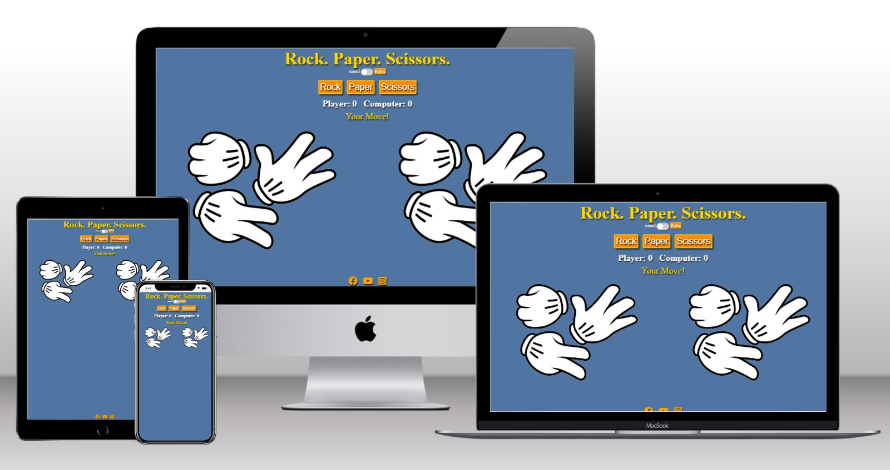

# Rock. Paper. Scissors

# Introduction
Welcome to Rock. Paper. Scissors, A responsive, mobile first game built to play a quick, colourful and fun computer version of rock, paper, scissors..

Live site link: https://01anto.github.io/rock-paper-scissors/

# User Requirements

  ## User Stories

  - As a user I want:

    - To play a quick game of rock paper scissors.
    - To know what the website is about the moment I see the website.
    - An easy to navigate website, no matter what device I use to access it.
    - For the game to be colourful and fun with some sound effects.

# Design

  ## Images
  
  
  
  

  # Features

  ## Controls

  # Testing

  ## Mobile testing

   - The website was built from the start with mobile first design. It has been tested with
     chrome dev tools on smaller screens and it is responsive.
   - Once the website went live I accessed the website through various phones and ensured
     that it performed as expected.

  ## Desktop testing

 - Large Monitor and TV

   - The website has been tested with chrome dev tools for larger screens and it is
     responsive.
   - Once the website went live I accessed the website using a larger monitor and TV and
     ensured that it performed as expected. One issue occuring with the TV is highlighted below in unfixed bugs.

  ## Browser Testing

   - Once the website went live it was run and tested on browsers and performs
     as expected.

  ## Validator Testing

   - W3C HTML Validator - Passed
   - W3C CSS Jigsaw Validator - Passed
   - Lighthouse Results:
   - 
   - jshint - passed

