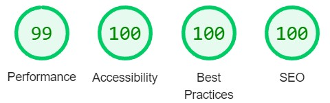

# Rock. Paper. Scissors

# Introduction
Welcome to Rock. Paper. Scissors, A responsive, mobile first game built to play a quick, colourful and fun computer version of rock, paper, scissors..

Live site link: https://01anto.github.io/rock-paper-scissors/

# User Requirements

  ## User Stories

  - As a user I want:

    - To play a quick game of rock paper scissors.
    - To know what the website is about the moment I see the website.
    - An easy to navigate website, no matter what device I use to access it.
    - For the game to be colourful and fun with some sound effects.

# Design

  ## Images
  
  
  
  

  # Features

  ## Controls
  ##

  # Testing

  ## Mobile testing

   - The website was built from the start with mobile first design. It has been tested with
     chrome dev tools on smaller screens and it is responsive.
   - Once the website went live I accessed the website through various phones and ensured
     that it performed as expected.

  ## Desktop testing

 - Large Monitor and TV

   - The website has been tested with chrome dev tools for larger screens and it is
     responsive.
   - Once the website went live I accessed the website using a larger monitor and TV and
     ensured that it performed as expected. One issue occuring with the TV is highlighted below in unfixed bugs.

  ## Browser Testing

   - Once the website went live it was run and tested on browsers and performs
     as expected.

  ## Validator Testing

   - W3C HTML Validator - Passed
   - W3C CSS Jigsaw Validator - Passed
   - Lighthouse Results:
   - 
   - jshint - passed
  
  # Bugs

  ## Fixed Bugs

   - Upon running lighthouse it highlighted a contrast issue with my rules paragraph. The styling was adjusted and this increased my lighthouse score.
   - Upon running jshint it highlighted some missing semi-colons, unused variables left from testing and code layout issues. Once these were amended, i ran jshint again and no issues were detected.
  
  ## Unfixed Bugs

   - Some sound effects do not play on my lg TV. I tested for this on my laptop, desktop monitor and various phones which all played sound with no issues.
  
# Deployment

 - The website was deployed using GitHub pages:

   - Go to the settings tab in the GitHub repository.
   - Using the menu on the left click on the pages tab.
   - In the Branch section use the drop-down menu and select 'main'.
   - After a few minutes the page provided a link to the live website.

# Future Features

   - javascript code that allows the user to click on the rules paragraph without it resetting game.
   - A customised 404 page that allows the user to navigate back to website.

# Languages Used

   - HTML
   - CSS
   - Javascript

# Frameworks and Libraries used

   - [Gitpod IDE](https://www.gitpod.io/)
    - All code for this website was created using Gitpod.

   - [GitHub](https://github.com/)
    - All code for this website was added, commited, pushed to and deployed using github.

   - [Font Awesome](https://fontawesome.com/)
    - The Icons for the logo and social links were taken from Font Awesome.
    
   - [Techsini](https://techsini.com/multi-mockup/index.php)
    - The mockup image for the readme was created using Techsini.
   
# Credits

  ## Media

 - images taken from:
   https://www.bing.com/images/search?view=detailV2&ccid=as5zSfEA&id=15BBCF74BD081E3CAB771B8C026FB198A604AF51&thid=OIP.as5zSfEAyQdEMkBFxmZvNAHaGP&mediaurl=https%3a%2f%2fvectorified.com%2fimage%2frock-paper-scissors-vector-22.png&cdnurl=https%3a%2f%2fth.bing.com%2fth%2fid%2fR.6ace7349f100c90744324045c6666f34%3frik%3dUa8EppixbwKMGw%26pid%3dImgRaw%26r%3d0&exph=691&expw=820&q=Rock+Paper+Scissors+Drawing&simid=608035187682051565&FORM=IRPRST&ck=8DCCB665DED98D36687455CA3B5B6A58&selectedIndex=9&ajaxhist=0&ajaxserp=0-->

  ## Acknowledgements

   - I would like to thank my mentor Spencer Barriball for all his help and advice throughout
     this project.

